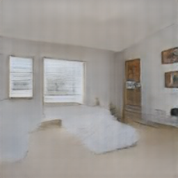
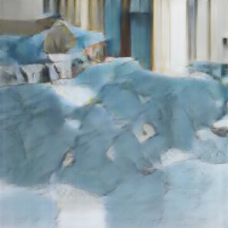
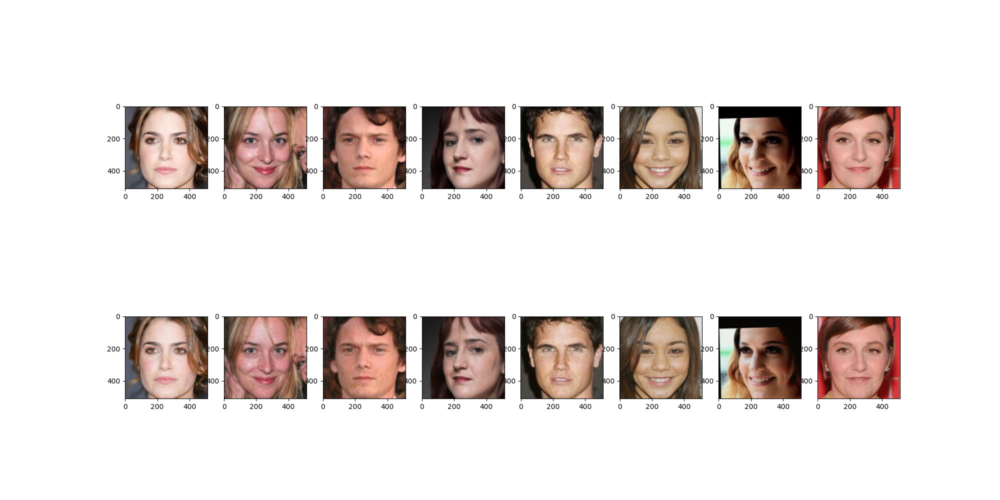
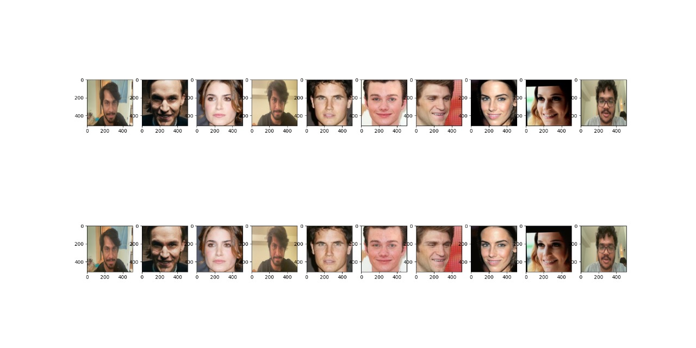

# GAN You Feel the Love Tonight

This repository contains materials related to the semester-long project for CMPE 255 (Data Mining).

## Team

* Brian Ho ([hobriandh](https://github.com/hobriandh))
* Chinmay Kamerkar ([mercury297](https://github.com/mercury297))
* Pratik Kasle ([PRKKILLER](https://github.com/PRKKILLER))
* Andrew Selvia ([AndrewSelviaSJSU](https://github.com/AndrewSelviaSJSU))

## Presentation

We presented the core principles of GANs to the class on March 9th. You can review our presentation in either its original [Keynote format](Presentation.key) or [PDF format](Presentation.pdf). Since we were the first to present, we had not had time to implement any of our ideas, thus this report presents details about our implementation strategies.

## Abstract

Our research focuses on *Generative Adversarial Networks* (GANs). We chose to divide the work so we could explore two unique applications of GANs. This way, we could compare and contrast the efficacy of different architectures and approaches. Andrew and Brian chose to focus on training a GAN to generate pictures from text; in other words, text-to-image. Chinmay and Pratik chose to focus on...

## Text-to-image

### Approach

Text-to-image applications present an immediate opportunity for GANs to demonstrate their value. Creative fields such as graphic design, architecture, and video editing are obvious candidates for early option. One can imagine an architect being able to ideate designs far more quickly, potentially even in real-time with their clients. Business models may also evolve due to this research; for instance, property owners equipped with smartphones could potentially use a generative model to independently explore renovation ideas without the direct assistance of a trained architect.

[Various papers and projects exploring this space](https://paperswithcode.com/task/text-to-image-generation) were researched to provide a basic understanding of the state-of-the-art. Andrew chose to use [StackGAN-v2](https://github.com/hanzhanggit/StackGAN-v2) (based on [the StackGAN++ paper](https://arxiv.org/abs/1710.10916)) as a baseline due to its foundation on PyTorch which has been growing in popularity in research circles. Obviously, the project was not ready for use right off the shelf; specifically, it required modifications and modernization to run properly on the SJSU High Performance Computing (HPC) system. You can browse all the changes required to get the project working on the HPC on [the cmpe255 branch of Andrew's fork of StackGAN-v2](https://github.com/AndrewSelviaSJSU/StackGAN-v2/tree/cmpe255). If you would like to run StackGAN-v2 on the HPC yourself, follow [these instructions](https://github.com/AndrewSelviaSJSU/StackGAN-v2/blob/cmpe255/cmpe255.md).

Quickly, let us establish the importance of the HPC. We need to store hundreds of gigabytes of image data and train multiple deep neural networks (GANs train both a generator and discriminator). The latter is an especially taxing task without the aid of at least one GPU. The HPC provides us with both the disk space and GPU nodes necessary to accomplish our research. More importantly, given the fact that we're students, it's free (unlike if we were forced to use an external cloud platform). Thus, for speed of iteration, it was critical for us to adapt our work for the SJSU HPC.

### Results

After training StackGAN-v2 on [the Caltech-UCSD birds data set](http://www.vision.caltech.edu/visipedia/CUB-200-2011.html), Andrew was able to generate thousands of novel images including those selected below.

First, observe this fairly believable sample for the input text: "medium sized bird with a stout beak and brown and white feathers." Here, the model demonstrates its ability to comprehend the size and color explicitly defined in the text. Interestingly, it has also learned to place the bird in a believable scene, perched on a branch; though, the angle and length of the legs seem slightly off. Whether the blur applied to the background is a lesson learned from bokeh-style photographs in the training dataset or simply a clever trick learned by the generator to bypass the discriminator is unclear.


Next, let us consider the result for this sentence: "this bird has a long brown bill and is brown all over." Obviously, the generated image bears some resemblance to a duck floating in water. However, its warped and distorted proportions ruin the effect. Interestingly, the generator appears to have made an attempt to create a reflection in the water; no doubt due to the presence of reflections in the training data set. Compared to the first sample, this one seems more likely to fail judgment by humans. 


### Extension

Since the text-to-image problem was solved with time to spare, Andrew proceeded to explore a separate, but related problem: generating pictures of bedrooms via a GAN trained on images from the [lsun](https://www.yf.io/p/lsun) bedroom dataset. This was supported by the existing StackGAN-v2 implementation. You can run the code yourself as described [in the runbook](https://github.com/AndrewSelviaSJSU/StackGAN-v2/blob/cmpe255/cmpe255.md#bedrooms).

The results include images such as this one which paints a fairly believable image including light streaming through multiple windows:



It even seems to have learned about blinds and wall art. However, there are also plenty of images that look like jumbled blobs like this one:



#### Evaluation

While presenting these results in class, the professor questioned if there was not a more quantitative way of evaluating the efficacy of GANs. For instance, the bedroom image generation problem is so common as to have been solved by many novel GANs introduced in the past few years. How does one determine which performs the task best?

This sparked Andrew to investigate this question and read multiple research papers to understand how researchers operating at the bleeding edge of GAN development compare their results. This series of papers by Ali Borji proved the most educational:

* [Pros and Cons of GAN Evaluation Measures: New Developments](https://arxiv.org/abs/2103.09396): An updated version of his previous paper which fast-forwards to the state of GAN evaluation as of March 2021.
* [Pros and Cons of GAN Evaluation Measures](https://arxiv.org/abs/1802.03446): Ali's original comparative analysis of various GAN evaluation methods.
  
In addition, the following papers are worth reading:

* [Are GANs Created Equal? A Large-Scale Study](https://arxiv.org/abs/1711.10337)
* [GANs Trained by a Two Time-Scale Update Rule Converge to a Local Nash Equilibrium](https://arxiv.org/abs/1706.08500): Introduced FID
* [Improved Techniques for Training GANs](https://arxiv.org/abs/1606.03498): Ian Goodfellow's initial commentary on the subject.

For a lighter introduction, you may choose to start with these articles:

* [How to Evaluate Generative Adversarial Networks](https://machinelearningmastery.com/how-to-evaluate-generative-adversarial-networks/)
* [How to Implement the Frechet Inception Distance (FID) for Evaluating GANs](https://machinelearningmastery.com/how-to-implement-the-frechet-inception-distance-fid-from-scratch/)

The outcome of this research was awareness of the various measures that are currently being employed to compare GANs. Specifically, it reinforced that GAN evaluation is a particularly difficult problem because (unlike traditional classification or regression problems) there is no ground truth against which to compare a model's predictions. Instead, results must be measured for clarity (i.e. are there observable blemishes, smears, or noise artifacts), domain-fit (i.e. are the results believable within the context of the domain they emulate), and modality (i.e. do the results cover the full extent of the domain or are they isolated to a narrow band of potential outputs).

To address the first (clarity) and third (modality) metrics, it seems many recent papers have chosen to judge themselves using the Frechet Inception Distance (FID). FID is a measure of the distance between two datasets by comparing how well a trained classifier (specifically, Inception v3) can classify samples between the two datasets. In practice, if one was to compare two identical data sets, their FID should be 0. In general, the lower the FID, the better the GAN. For instance, StyleGAN yielded a FID of 2.65 on the bedroom image generation task according to Figure 10 from [its paper](https://arxiv.org/pdf/1812.04948v3.pdf). In comparison, the FID for the bedroom images Andrew generated with StackGAN-v2 is 3.967. Based on the improved clarity of the StyleGAN results to the human eye, this measure aligns with our expectations. 

### Conclusion

Despite some impressive results, this project illuminated the challenges GANs continue to face in exploring the vast search spaces involved in the text-to-image problem. It also informed how GANs have evolved since their introduction in 2014. In 7 years, researchers have propelled GANs from their origin generating randomized black-and-white images in a given search space. Now, state-of-the-art GAN research is capable of producing color images indiscernible from real ones. New frontiers such as text-to-image GAN research are exploring the ability to guide the output of GANs (rather than simply employing them to produce randomized samples). It is our responsibility to lead this nascent field forward responsibly.

In the future, we plan to explore even more state-of-the-art GAN research. In particular, [this speech-to-image paper](https://arxiv.org/pdf/2004.03413.pdf) from last year seems promising. One can imagine many real-time applications where speech is a more natural input than text.

### References

* [Google: Introduction to GANs](https://developers.google.com/machine-learning/gan)
* [StackGAN++: Realistic Image Synthesis with Stacked Generative Adversarial Networks](https://arxiv.org/abs/1710.10916)
* [AttnGAN: Fine-Grained Text to Image Generation with Attentional Generative Adversarial Networks](https://arxiv.org/abs/1711.10485)
* [Direct Speech-to-image Translation](https://arxiv.org/abs/2004.03413)
* [LSUN: Construction of a Large-scale Image Dataset using Deep Learning with Humans in the Loop](https://arxiv.org/abs/1506.03365)

## Super Resolution (SR) GANs

### Approach

Super resolution GANs aims to increase the resolution of images.  SR GANs applies a deep neural network in combination with an adversary network to produce these images.  During the training, a high-resolution image is sampled along with a low-resolution counterpart.  The deep neural network acts as a generator which takes in the low-resolution image and outputs its own high-resolution image.  This generated image is then put into the discriminator network to determine whether the generated image is close enough to the ground truth or if it is just a generated image.


This machine learning project was run locally on a NVIDIA GeForce RTX 2060 graphics card.  In order to run on a local machine using a graphics card, there are some necessary drivers to install for tensorflow.  First, the [NVIDIA GPU Drivers](https://www.nvidia.com/download/index.aspx?lang=en-us) are needed.  Then the [NVIDIA CUDA Toolkit](https://developer.nvidia.com/cuda-toolkit-archive) is needed.  This project was run on CUDA v10.0 to work with the Tensorflow v2.0.0b1.  Lastly, the [NVIDIA cuDNN](https://developer.nvidia.com/rdp/cudnn-archive) version that matches the machine's CUDA version is needed.  Once all of these packages are installed, the user can run the program.

The dataset was pulled from the [DIV2K - bicubic downscaling x4 competition](https://data.vision.ee.ethz.ch/cvl/ntire17//).

To start training, the user needs to run the train script:
```bash
python train.py
```

The dataset was trimmed down to lessen the total runtime.  There were 48 total training images and 24 total validation images.
The initial generator was run for 50 epochs with 6 steps and each step took around 14.5 seconds.
In the second pass that included the discriminator, the model was run for 100 epochs with 12 steps and each step took around 65 seconds.

### Results

After training on the [DIV2K - bicubic downscaling x4 competition](https://data.vision.ee.ethz.ch/cvl/ntire17//) images, we were able to produce some higher-resultion image results.

First, we can view the generator as it initially trains without the discriminator network.  


We can see that the first ten epochs generated an incredibly blurry and almost unrecognizable images.  As more epochs run, the images start to become more recognizable, but the output is still low-resolution and is very blurry.  Here the model is just training on its own without any input from the discriminator yet.  We can see the generator can get the general gist of the image, but it cannot increase the quality of the image.  Some of the images also show some artifacting and the colors are warped.  We can see the warped colors mostly in the earlier epochs.  Instead of sharpening the image, it seems to blur the image by blending the colors to become duller.

Next, we train the generator along side with the discriminator.


Here, we can see the generated image in comparison with the ground truth high-resolution images.

Interestingly, we can see that the model is still changing the colors of the image.  This is most prevalent in the image with the woman's smile.  The model changed the woman's skin tone to become more bright and pink in an attempt to sharpen the image.  In the same image, the outlines seem more pixelated, however the details in the image are more accentuated.  The light reflecting off the womans lips and mouth are more pronounced than in the low-resolution image.  We can also see the model trying to make out the pattern in the woman's earrings.

The model can handle straight lines very easily.  We can see in the image of the building that the GANs output is much closer to the ground truth high-resolution image.  The coloring is only slightly off in this output as well.  We can also note that in the bottom right of the image the GANs output has also made a good attempt at finding the reflection in the glass.  Also, the model makes a good attempt at making out what looks like vents on the side of the building.

The last image shows how the model can fail at some minute details.  We can see that the output can create a good part of the overall colors and larger part of the train's shape.  However, if we look at the trees in the window of the car, there is a loss of detail.  The branches of the tree were interpreted from the low-resolution image as separate balls.  Although the model incorrectly interpreted what the low-resolution image was showing, the output shows a high-quality interpretation where the broken up branches are accentuated.

### Conclusion

Our results showed the key parts of how the model works.  The SR GANs model would work incredibly well when there are little details and less complex shapes in the low-resolution input image.  However, the model tries to accentuate small details with its best guess when those details are introduced.  Another area where this model succeeds is its ability to sharpen not just grayscale images, but also colored images.

These examples show what the model can output given more steps and epochs.  This model ran 100 epochs with 100 steps for the initial generator and 2000 epochs with 50 steps with the discriminator model included.  This is also not using the truncated dataset, but instead 800 images for training and 100 images for validation.


In the future, we plan on running the full dataset with the necessary amounts of epochs and steps.  However, since the time for training goes up exponentially with those increased metrics, it just was not feasable for running on our local machine even when it was running on an NVDIA GPU.  From this project the key points we learned was how a GANs model worked and how to incorperate an NVIDA graphics card into our training to expedite the training time.

### References

* [Google: Introduction to GANs](https://developers.google.com/machine-learning/gan)
* [TensorLayer approach to creating SR GANs](https://github.com/tensorlayer/srgan)


## TODO: Chinmay & Pratik

### Approach
Face aging, also known as age synthesis and age progression, is defined as aesthetically rendering a face image with natural aging and rejuvenating effects on the individual face. It has plenty of applications in various domains including cross-age face recognition, finding lost children
and entertainment. The presented traditional face aging approaches are limited to modeling of the aging patterns missing the global comprehension of a human face (its personality traits, facial expression, possible facial accessories etc.) However, in many real-life use cases, face aging must be combined with other
face alterations, such as adding sunglasses or beard. These non-trivial modifications require global generative models of
human faces. Natural image generation has been thoroughly studied for years, but it has not been until 2014 when advances in deep learning has allowed to produce image samples and interpolations of very high visual fidelity. You can browse all the changes required to get the project working on the HPC on the cmpe255 branch of [Chinmay's](https://github.com/mercury297/Fast-AgingGAN) or [Pratik's](https://github.com/PRKKILLER/Fast-AgingGAN) Github

##Two Primary Modules:
1. Identity-preserved module 
2. Age Clissification module 

### Face Aging using GANs


### Dataset
IMDB-Wiki cleaned dataset of about 120K images. 
### Architecture Diagram


### Notable papers exploring this space.
[1. Wang_Face_Aging_With_CVPR_2018_paper](https://openaccess.thecvf.com/content_cvpr_2018/papers/Wang_Face_Aging_With_CVPR_2018_paper.pdf)

[2. Face Aging With Conditional Generative Adversarial Networks](https://arxiv.org/pdf/1702.01983.pdf)

### Results
After testing FastGAN , Pratik and Chinmay were able to generate hundreds of aged images of celebrities including those selected below.

Let us take a look at this collection of images of celebrities. The images seem to have a subtle change in a multitude of facial features like the skin tone, skin texture, lines and creases on their faces. It can be seen that the images with more lines such as the ones with wider smiles or dimples have deepend. The skin has more blemishes and the complexion does not seem highly affected althought the hair were not grey in any of the outputs. They realized that the images aged a certain way because the train dataset consisted of actors images with an age difference of 20 odd years.



This led Chinmay and Pratik to further test this model on pictures of their present and younger selves. The results were quite impressive on the surface level but as it would seem with the previous GAN the results were very much dependent on the trained dataset. The areas on our skin with aberrations exacerbated and the texture as predicted had more blemishes but yet again the hair color did not change.



### Conclusion
This project elucidated the short-comings and challenges GANs continue to face involved in the face-aging problem. Now, state-of-the-art GAN research is capable of producing images aged 20 more years from current images. This paradigm of Machine Learning should be pursued enthusiastically owing to the multitude of areas of application and responsibly considering the privacy issues it has tied to it. 
